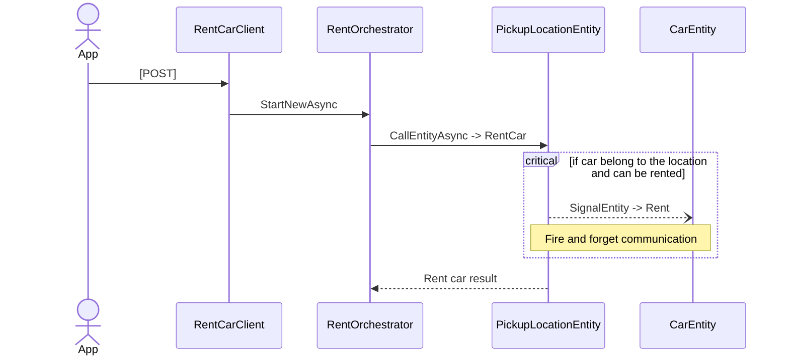

# ServerlessCarRent
A simple Car Rent System using Durable Entities

## Sequences

```mermaid
sequenceDiagram
    actor App
    participant RentCarClient
    participant RentOrchestrator
    participant PickupLocationEntity
    participant CarEntity
    App ->> RentCarClient : [POST]
    RentCarClient ->> RentOrchestrator : StartNewAsync
    RentOrchestrator ->> PickupLocationEntity : CallEntityAsync -> RentCar
    critical if car belong to the location and can be rented
        PickupLocationEntity --) CarEntity : SignalEntity -> Rent
        Note over PickupLocationEntity,CarEntity: Fire and forget communication
    end
    PickupLocationEntity -->> RentOrchestrator : Rent car result 
```
