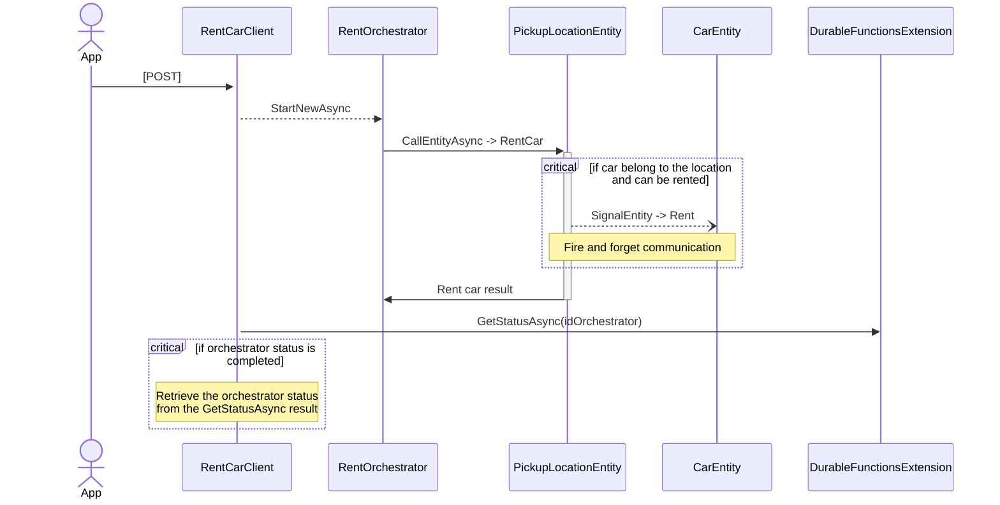

# ServerlessCarRent
This project use Durable Functions (in particular Durable Entities) to implement a simple Car Rent system.

## Architecture
The following image shown the architecture of the solution.

The solution is composed by three logical layers:
* **API Layer**: contains the Azure Functions (in particular Client Functions) that implement the REST API endpoints for the solution;
* **Data Layer**: contains two types of Functions:
    * Durable Entities: implement the entities with state of the solution. Car, PickupLocation and CarRentals are the entity of the solution;
    * Orchestrator Functions: implement the workflow called by the API Layer in which you need to interact with Entities in a synchronous way. One of this is the Rent Car scenario;
* **Integration Layer**: contains Orchestrator Functions and Activity Functions used to communicate with external services.

## Functions

### Clients
 
### Orchestrators

### Entities

### Activities

## Sequence Diagrams

### Rent a car

