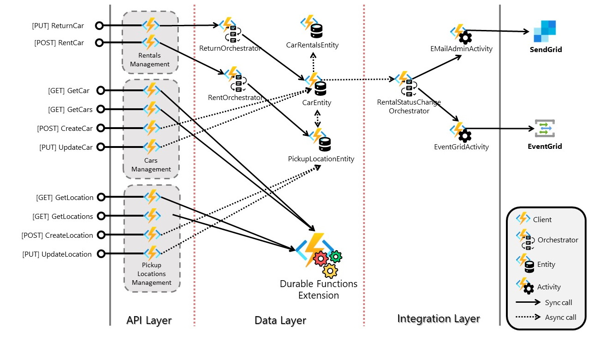
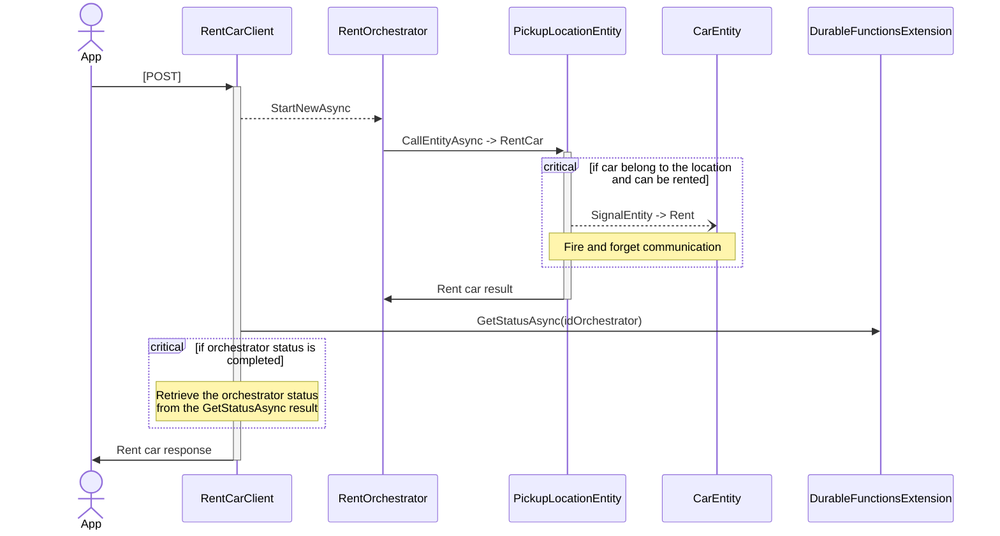
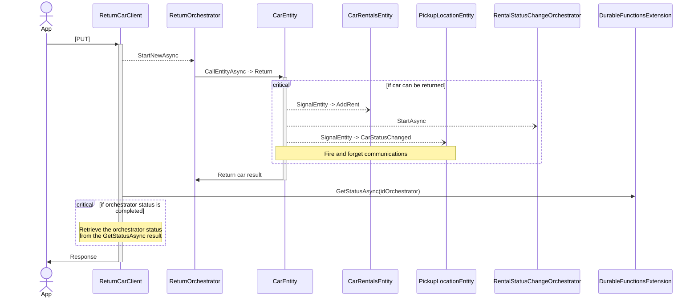

# ServerlessCarRent
This project use Durable Functions (in particular Durable Entities) to implement a simple Car Rent system.

## Architecture
The following image shown the architecture of the solution.

The solution is composed by three logical layers:
* **API Layer**: contains the Azure Functions (in particular Client Functions) that implement the REST API endpoints for the solution;
* **Data Layer**: contains two types of Functions:
    * Durable Entities: implement the entities with state of the solution. Car, PickupLocation and CarRentals are the entity of the solution;
    * Orchestrator Functions: implement the workflow called by the API Layer in which you need to interact with Entities in a synchronous way. One of this is the Rent Car scenario;
* **Integration Layer**: contains Orchestrator Functions and Activity Functions used to communicate with external services.

## Functions

### Clients
In this solution the Client Functions are used to expose a set of APIs (REST) and call orchestrators, entities and Durable Functions platform behind the scenes.  
 
### Orchestrators
In this solution, we use the orchestrators in two different ways:
* to "sinchronize" operations between client and entity: a client can only execute a signal operation against an entity. This means that the client continues its own flow while the entity method of the signal operation will be called in asynchronous way. In some scenarios (e.g. rent a car), we need to wait the result of the operation, and to do that, we use an orchestrator.
* to implement integration flows from our solution to the external world.

### Entities
This solution has three different entities:
* CarEntity: it manages a single car. Its status contains only the current rental (if exist).
* PickupLocationEntity: it manages a pickup location with different cars.
* CarRentalsEntity: it stores all the rental history for a car. Its status contains all the rentals completed for a specific car.

### Activities
This solution uses activities to implement atomic operation for the external services integration (e.g. send an event to Event Grdi).

## Sequence Diagrams

### Rent a car

### Rent a car

